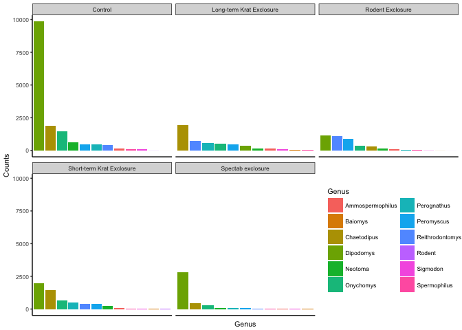

BIO593 Assignment 3
================
Kevin Wong, Danielle Jordan, Roxy Roja
2018-03-26

Introduction of the data
------------------------

This document uses data with life-history, population, and ecological examples. This data can be cited here: <http://dx.doi.org/10.6084/m9.figshare.1314459>. We will provide an indepth analysis containing plots that visually represent trends in the data and statistical analyses to accurately describe the trends. We will outline the major questions with this dataset.

Introduction of the problem
---------------------------

Our analyses investigate how differential plot types can influences rodent species weight, sex ratios, hindfoot length, and abundances. The following markdown will couple illustrative figures with statistical analyses to determine if plot types affect rodent species.

Question 1
----------

Does plot type affect the relationship between hindfoot length and sex of rodent species?

Question 2
----------

Does plot type affect the relationship between weight and sex of rodent species?

Question 3
----------

How does rodent species abundance change in each plot type? 

Question 4
----------

How does the total number of rodents change in each plot type over time? 
